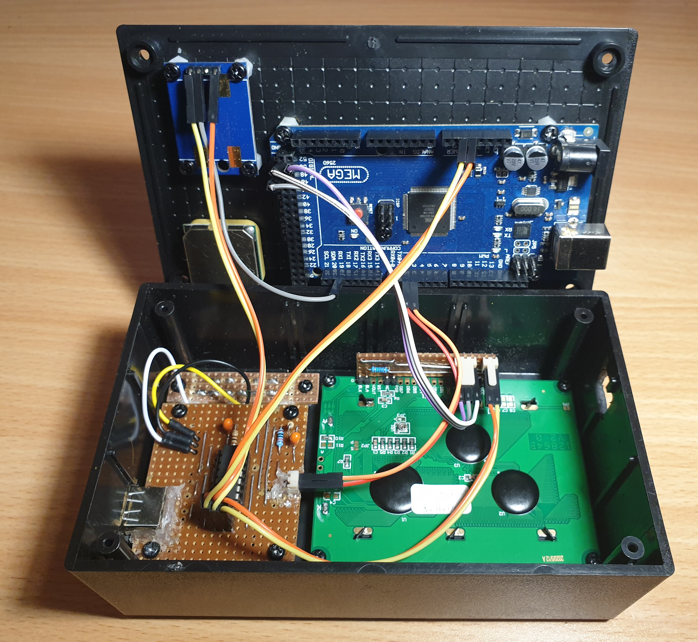
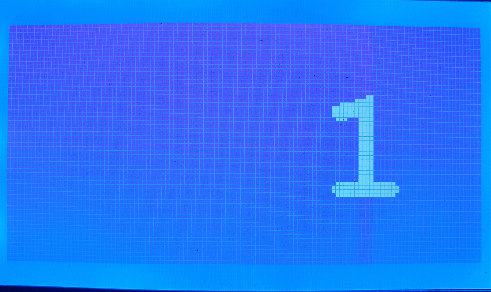

# GPS unit

This github repository details the construction of a GPS unit with custom clock and speed screens

It is based on a GPS receiver board with included antenna using the NEO6MV2 module, outputting NMEA data at 9600 baud each second. All is coordinated by a MEGA 2560 compatible microcontroller board. Information is displayed on a 128x64 LCD screen. Control is effected by just two push buttons interfaced to the microcontroller with a hardware debouncing circuit utilizing a 74HC14 Schmitt trigger IC. Power at 5.1V is assumed to be supplied into a USB-A female connector.

There are three screens available:

1. Displays the current time, date, lattitude, longtitude, speed (SOG) and height (ASL). A calculated day of the week is shown as (m, t, w, T, f, s, S) and displayed before the date. There is a facility to edit an offset to the UTC for displaying local time. This is retained when power is off. This screen is intended for navigating in the great outdoors.

    

    The UTC offset occupies 4 character positions at the top right of the screen. Press RB (right button) to enter edit mode, with an underscore appearing under the 1st character to be edited. Now press LB (left button) several times to set the 1st character (the available characters are "blank",+,-,0,1,2,3,4,5,6,7,8,9,½). Press RB again and then RL several times to set the 2nd character. Repeat for 3rd and 4th characters. Finally press RB which exits edit mode. This error checks the input for validity, reformats it if necessary and redisplays it. An error becomes "  +0" while eg. "-½ 1" becomes "  -½". Non-edit mode is indicated by a "●" appearing under the 4th character.  

1. Just displays the time (UTC+adjustment) and date, with a calculated day of week shown as (Mon, Tue, Wed, Thu, Fri, Sat, Sun). Large fonts are used. This screen is intended for use as a household clock. In the top right had corner of the screen is displayed the adjustment in hours (and/or halves) to UTC that gives us the actual displayed time and date.

    
1. Just displays the speed over ground (SOG) in km/h. It uses a larger font and display only to the nearest km/h, ie. no decimals. This screen is intended as a vehicle speedometer.

    

On power up the 1st screen is displayed. You can cycle through the screens by repeatedly pressing LB, ie. the left of the two buttons.

There are just 5 modules in this build. Below we describe them and their interconnections:

1. The Arduino MEGA 2560 microcontroller [module](Images/MEGA2560.jpg)
    - Power is supplied to the POWER 5V and POWER GND pins from J1-1 and J1-2 on the main circuit board.
    - The pushbutton interrupt pins D2 and D3 are connected to J4-1 and J4-2 on the main circuit board.
    - The GPS serial connection is effected by the D19 (RX1) pin being connected to the TX pin on the GPS module. (The RX direction is not implemented).
    - The LCD display is controlled by D53, D51 and D52 being connected to pins 4, 5 and 6 respectively on the LCD module interfacing circuit board. These are labelled RS, R/W and E on the actual LCD board).
1. The GPS Receiver [module](Images/GPSmodule.jpg)
    - Power is supplied to the VCC and GND pins from J2-1 and J2-2 on the main circuit board.
    - The TX pin is connected to the Arduino MEGA as detailed above.
    - The RX pin is unconnected.
1. The LCD module with attached [interfacing circuit board](Images/GPSboardB.png)
    - Power is supplied to the VCC and GND pins (ie. J3-2 and J3-1) from J3-1 and J3-2 on the main circuit board.
    - The display is controlled via pins J5-1, J5-2 and J5-3 connected the to Arduino MEGA as detailed above.
1. The [main circuit board](Images/GPSboardA.png) for power input and hardware debouncing.
    - The veroboard layout is given [here](Images/GPSboardA.pdf).
1. The [mini circuit board](Images/GPSboardA.png) that contains the two pushbuttons used for interfacing to this GPS unit.

## List of parts

### Core Components

| Qty | Product | Description | AUD Cost | Comment | Designator |
| --- | --- | --- | --- | --- | --- |
|1| [XC3712](https://jaycar.com.au/p/XC3712) | GPS Receiver Module| $49.95 | A GPS receiver using the NEO6MV2 module, outputting NMEA data at 9600 baud. | connected to J2-1 (5V), J2-2 (GND) and TX to D19 (RX1) on MEGA |
|1| [XC4420](https://jaycar.com.au/p/XC4420) | Duinotech MEGA 2560 r3 Board | $49.95 | Arduino compatible Microcontoller brains of this project | |
|1| [XC4617](https://jaycar.com.au/p/XC4617) | 128x64 Dot Matrix LCD Display Module | $29.95 | Arduino compatible backlit graphics display based on ST920 chipset | |
|1| [ZC4821](https://jaycar.com.au/p/ZC4821) | 74HC14 Hex Schmitt trigger Inverter CMOS IC | $1.45 | Used in the hardware keypress debouncing circuit | U4 |
|1| [PI6501](https://jaycar.com.au/p/PI6501) | 14 Pin Production (Low Cost) IC Socket| $0.40 | part of hardware debounce circuit | under U4 |
|2| [RR0596](https://jaycar.com.au/p/RR0596) | 10k Ohm 0.5 Watt Metal Film Resistors - Pack of 8 ( only need 2 )| $0.85 | part of hardware debounce circuit | R2, R4 |
|2| [RR0548](https://jaycar.com.au/p/RR0548) | 100 Ohm 0.5 Watt Metal Film Resistors - Pack of 8 ( only need 2 ) | $0.85 | used in hardware debounce circuit | R1, R3 |
|2| [MCCB](https://au.element14.com/multicomp/mccb1v104m2acb/cap-0-1-f-35v-20/dp/9708480) | Tantalum Capacitor, 0.1 µF, 35 V, MCCB Series, ± 20%, Radial Leaded, 5.08 mm | $0.96 | used in hardware debounce circuit | C1, C2 |
|1| [PS0916](https://jaycar.com.au/p/PS0916) | USB TYPE A PC MOUNT Socket | $2.95 | 5.1V power for circuit | U3 |
|2| [SP0721](https://jaycar.com.au/p/SP0721) | Black Snap Action Keyboard Switch - PCB Mount | $2.90 | interface control | SW1, SW2 |
